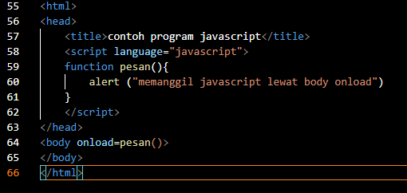
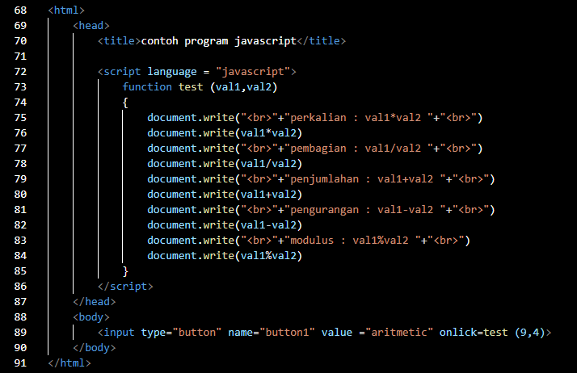
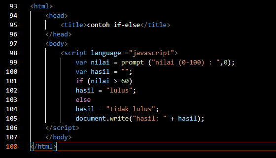
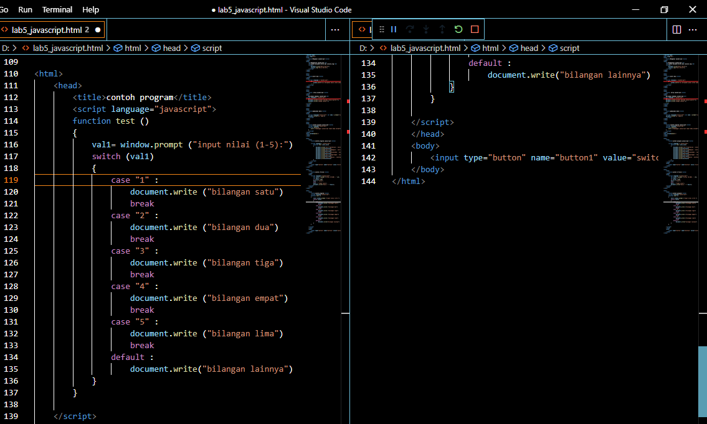
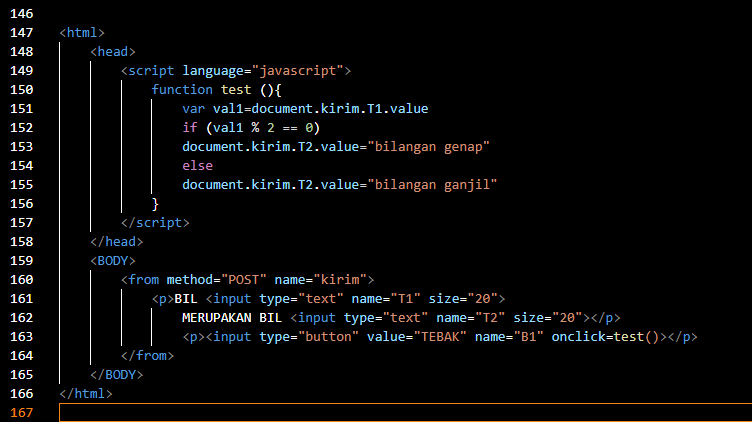

# Lab5Web
## Nama     : Rony Eltom Atibaman
## NIM      : 312010003
## Kelas    : TI.20.D.1
## MATKUL   : Pemograman WEB

###  Praktikum 5: Javascript
>>Persiapan membuat dokumen HTML dengan nama file lab5_javascript.html seperti berikut. 

>> Javascrip Dasar
Pemakaian Alert sebagai property window. 

>> Pemakaian method dalam objek 

>> Pemakaian Prompt 

>> Pembuatan fungsi dan cara pemanggilannya 

### Dasar Pemrograman Di Javascript
>> Operasi dasar aritmatika 

>> Seleksi kondisi (if..else) 

>> Penggunaan operator switch untuk seleksi kondisi. 

### Pembuatan Form
>> Form Input.

>> Form Button.  
